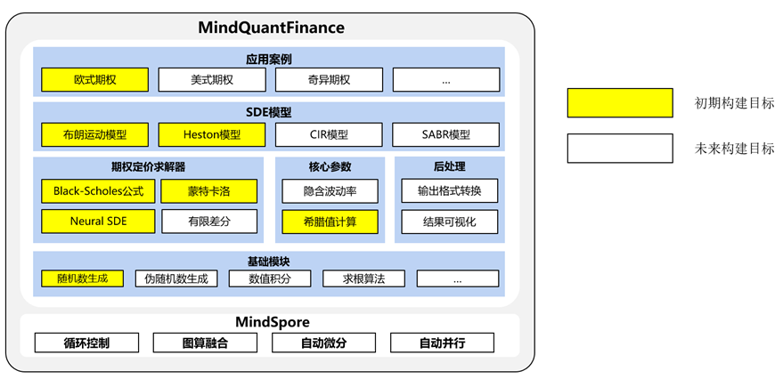

# MindQuantFinance

在量化金融领域，需要使用数值计算方法对各类资产进行定价。本项目基于全场景AI计算框架MindSpore，实现了资产定价模型，可充分利用CPU、GPU和Ascend提供的算力，完成数值模拟计算。 



### 开发模式安装

1. 从代码仓下载源码

    ```bash
    cd ~
    git clone https://gitee.com/luweizheng/mind-quant-finance.git
    ```

2. 开发者模式安装

    ```bash
    cd ~/mind-quant-finance
    pip install -e ./ -i https://pypi.tuna.tsinghua.edu.cn/simple
    ```